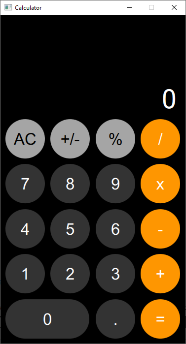

# Calculadora (QML/Qt)

Este tutorial tem como objectivo apresentar todos os passos da implementação
de uma calculadora gráfica usando a framework **Qt**.
Para desenvolver o interface gráfico da calculadora é usada a linguagem **QML**.
O comportamento dinâmico da calculadora é implementado usando a linguagem de
programação **Javascript**.

O aspecto final da aplicação é o seguinte:

  

